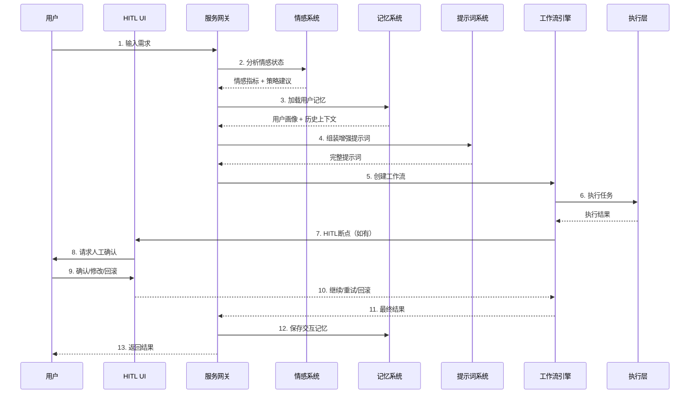

# 增强型 Agent 系统 - 架构设计文档

**版本**: v1.0
**日期**: 2026-03-10
**状态**: 设计阶段

---

## 1. 文档概述

### 1.1 目的
本文档描述增强型商用 Agent 系统的整体技术架构，包括：
- 四层架构设计（用户交互层、服务网关层、执行层、基础设施层）
- 四大增强系统（情感、记忆、提示词、虚拟形象）
- HITL 人机协同系统
- 电商+自媒体运营模块

### 1.2 范围
- 系统架构全景
- 模块划分与职责
- 接口定义规范
- 数据流向设计
- 非功能性需求

### 1.3 术语表

| 术语 | 定义 |
|------|------|
| Agent | 具备特定能力的智能体，可独立执行任务 |
| HITL | Human-in-the-Loop，人机协同机制 |
| RAG | Retrieval-Augmented Generation，检索增强生成 |
| Workflow | 由多个节点组成的有向无环图，定义业务流程 |
| Subagent | 被主 Agent 调用的子智能体 |

---

## 2. 系统架构全景

### 2.1 架构分层

```
┌─────────────────────────────────────────────────────────────────────────────┐
│ Layer 4: 用户交互层 (Presentation Layer)                                     │
├─────────────────────────────────────────────────────────────────────────────┤
│  Web Portal │ Electron App │ Mobile H5 │ Digital Human UI │ Admin Dashboard │
└─────────────────────────────────────────────────────────────────────────────┘
                                      │
                                      ▼
┌─────────────────────────────────────────────────────────────────────────────┐
│ Layer 3: HITL UI 系统 (Human-in-the-Loop)                                    │
├─────────────────────────────────────────────────────────────────────────────┤
│  Breakpoint Manager │ Approval Center │ Intervention Panel │ Collaboration  │
└─────────────────────────────────────────────────────────────────────────────┘
                                      │
                                      ▼
┌─────────────────────────────────────────────────────────────────────────────┐
│ Layer 2: 服务网关层 (Service Gateway)                                        │
├─────────────────────────────────────────────────────────────────────────────┤
│  ┌──────────────┐ ┌──────────────┐ ┌──────────────┐ ┌──────────────┐        │
│  │  Emotion     │ │   Memory     │ │    Prompt    │ │   Avatar     │        │
│  │  System      │ │   System     │ │   Enhancement│ │   System     │        │
│  └──────────────┘ └──────────────┘ └──────────────┘ └──────────────┘        │
│  ┌──────────────┐ ┌──────────────┐ ┌──────────────┐ ┌──────────────┐        │
│  │    Intent    │ │   Workflow   │ │    Agent     │ │     RAG      │        │
│  │  Recognition │ │   Engine     │ │   Orchestrator│ │   Retrieval  │        │
│  └──────────────┘ └──────────────┘ └──────────────┘ └──────────────┘        │
└─────────────────────────────────────────────────────────────────────────────┘
                                      │
                                      ▼
┌─────────────────────────────────────────────────────────────────────────────┐
│ Layer 1: 执行层 (Execution Layer)                                            │
├─────────────────────────────────────────────────────────────────────────────┤
│  ┌─────────────────────────┐  ┌─────────────────────────────────────┐      │
│  │   E-Commerce System     │  │       Content Creation System       │      │
│  │  Product │ Competitor   │  │  Hot Topics │ Content Planning     │      │
│  │  Pricing │ Inventory    │  │  Copywriting│ Multi-platform       │      │
│  │  Order   │ Analytics    │  │  Scheduling │ Analytics            │      │
│  └─────────────────────────┘  └─────────────────────────────────────┘      │
└─────────────────────────────────────────────────────────────────────────────┘
                                      │
                                      ▼
┌─────────────────────────────────────────────────────────────────────────────┐
│ Layer 0: 基础设施层 (Infrastructure)                                         │
├─────────────────────────────────────────────────────────────────────────────┤
│  MongoDB │ PostgreSQL │ Redis │ Elasticsearch │ MinIO │ RabbitMQ │ Milvus  │
└─────────────────────────────────────────────────────────────────────────────┘
```

### 2.2 模块职责矩阵

| 模块 | 职责 | 依赖模块 | 被依赖模块 |
|------|------|----------|------------|
| 情感反馈系统 | 检测用户情感，调整交互策略 | 记忆系统 | Gateway, HITL |
| 记忆系统 | 管理短期/长期/语义记忆 | 向量数据库 | 所有上层模块 |
| 提示词增强系统 | 动态组装提示词，RAG增强 | 记忆系统, RAG | Gateway |
| 虚拟形象系统 | 数字人渲染，语音动画 | TTS引擎 | 用户交互层 |
| 工作流引擎 | 工作流定义、执行、状态管理 | 任务调度 | 执行层 |
| HITL系统 | 断点、审批、干预、回滚 | 工作流引擎 | 用户交互层 |
| Agent编排器 | Agent注册、发现、调用、生命周期 | 工作流引擎 | Gateway |

### 2.3 核心交互流程



---

## 3. 技术选型与约束

### 3.1 技术栈总览

| 层级 | 技术组件 | 版本约束 |
|------|----------|----------|
| 运行时 | Node.js | >= 20.0.0 |
| 框架 | NestJS | >= 10.0.0 |
| 语言 | TypeScript | >= 5.0.0 |
| 数据库 | MongoDB | >= 6.0 |
| 缓存 | Redis | >= 7.0 |
| 消息队列 | BullMQ | >= 5.0 |
| 搜索引擎 | Elasticsearch | >= 8.0 |
| 向量数据库 | Milvus | >= 2.3 |
| 对象存储 | MinIO | >= 2024.x |

### 3.2 AI/ML 技术栈

| 能力 | 服务/模型 | 备选方案 |
|------|-----------|----------|
| LLM | OpenAI GPT-4o | 通义千问、DeepSeek |
| Embedding | text-embedding-3-large | BGE-M3 |
| 语音识别 | Whisper API | 阿里云 ASR |
| 语音合成 | CosyVoice | Azure TTS |
| 数字人 | SadTalker | MuseTalk |

### 3.3 设计约束

**性能约束**:
- API 响应时间：P99 < 500ms（简单查询），P99 < 2s（复杂工作流）
- 并发支持：单节点 1000 QPS，集群水平扩展
- 工作流执行：支持 1000+ 并发工作流实例

**可靠性约束**:
- 系统可用性：99.9%（年度停机 < 8.76 小时）
- 数据持久化：工作流状态必须持久化，支持故障恢复
- 消息可靠性：至少一次投递，支持幂等消费

**安全约束**:
- 数据传输：全链路 TLS 1.3
- 敏感数据：加密存储（AES-256）
- 访问控制：RBAC + ABAC 混合模型

---

## 4. 接口设计规范

### 4.1 REST API 规范

**URL 规范**:
```
/api/v{version}/{resource}/{action}
```

**响应格式**:
```typescript
interface ApiResponse<T> {
  success: boolean;
  data?: T;
  error?: {
    code: string;
    message: string;
    details?: Record<string, any>;
  };
  meta?: {
    requestId: string;
    timestamp: string;
    pagination?: PaginationInfo;
  };
}
```

**错误码规范**:

| 错误码 | 含义 | HTTP 状态 |
|--------|------|-----------|
| AGENT_001 | Agent 未找到 | 404 |
| AGENT_002 | Agent 执行超时 | 408 |
| WORKFLOW_001 | 工作流不存在 | 404 |
| WORKFLOW_002 | 工作流执行失败 | 500 |
| WORKFLOW_003 | 工作流版本冲突 | 409 |
| HITL_001 | 断点已过期 | 410 |
| HITL_002 | 无审批权限 | 403 |
| MEMORY_001 | 记忆检索失败 | 500 |
| EMOTION_001 | 情感分析失败 | 500 |

### 4.2 事件规范

**事件格式**:
```typescript
interface DomainEvent {
  eventId: string;          // UUID v4
  eventType: string;        // 事件类型
  aggregateId: string;      // 聚合根ID
  aggregateType: string;    // 聚合类型
  version: number;          // 事件版本
  timestamp: string;        // ISO 8601
  payload: Record<string, any>;
  metadata: {
    correlationId: string;  // 关联ID（追踪用）
    causationId: string;    // 因果ID
    userId?: string;
  };
}
```

**核心事件类型**:
- `workflow.execution.started`
- `workflow.execution.completed`
- `workflow.execution.failed`
- `workflow.node.executed`
- `hitl.breakpoint.created`
- `hitl.breakpoint.resolved`
- `agent.invocation.started`
- `agent.invocation.completed`

---

## 5. 非功能性需求

### 5.1 性能需求

| 指标 | 目标值 | 测量方法 |
|------|--------|----------|
| API 平均响应时间 | < 200ms | Prometheus histogram |
| API P99 响应时间 | < 500ms | Prometheus histogram |
| 工作流启动延迟 | < 100ms | 自定义指标 |
| 并发工作流数 | 1000+ | 压力测试 |
| 内存使用 | < 2GB/节点 | Node.js heap metrics |

### 5.2 可扩展性需求

- **水平扩展**：无状态服务支持水平扩展
- **数据分片**：按 userId 分片，支持数据隔离
- **功能扩展**：插件机制支持新 Agent 类型

### 5.3 可维护性需求

- **日志**：结构化日志（JSON），支持链路追踪
- **监控**：Prometheus + Grafana 监控大盘
- **告警**：分级告警（P0-P3），支持多渠道通知
- **文档**：API 文档自动生成（OpenAPI）

### 5.4 安全性需求

- **认证**：JWT + OAuth2.0
- **授权**：RBAC（基于角色的访问控制）
- **审计**：关键操作完整审计日志
- **加密**：敏感字段 AES-256 加密

---

## 6. 风险与缓解策略

### 6.1 技术风险

| 风险 | 影响 | 可能性 | 缓解策略 |
|------|------|--------|----------|
| LLM API 故障 | 高 | 中 | 多模型降级、本地缓存 |
| 向量检索性能瓶颈 | 高 | 中 | 预过滤、分片、缓存 |
| 工作流状态不一致 | 高 | 低 | 事件溯源、补偿事务 |
| 内存泄漏 | 中 | 低 | 定期压测、监控告警 |

### 6.2 业务风险

| 风险 | 影响 | 可能性 | 缓解策略 |
|------|------|--------|----------|
| HITL 流程阻塞 | 中 | 高 | 超时机制、自动升级 |
| Agent 决策偏差 | 高 | 中 | 关键节点人工审核 |
| 平台 API 变更 | 中 | 高 | 抽象适配层、监控告警 |

---

## 7. 附录

### 7.1 参考资料

- [AiToEarn 现有架构](../ref/AiToEarn-main/)
- [NestJS 最佳实践](https://docs.nestjs.com/)
- [BullMQ 文档](https://docs.bullmq.io/)

### 7.2 变更记录

| 版本 | 日期 | 变更内容 | 作者 |
|------|------|----------|------|
| v1.0 | 2026-03-10 | 初始版本 | - |

---

## 8. 待决策事项

1. **向量数据库选型**：Milvus vs Pinecone vs pgvector
2. **工作流引擎**：自研 vs Temporal vs Camunda
3. **前端框架**：继续使用现有 React 或迁移到 Vue3
4. **部署策略**：Docker Compose vs Kubernetes
