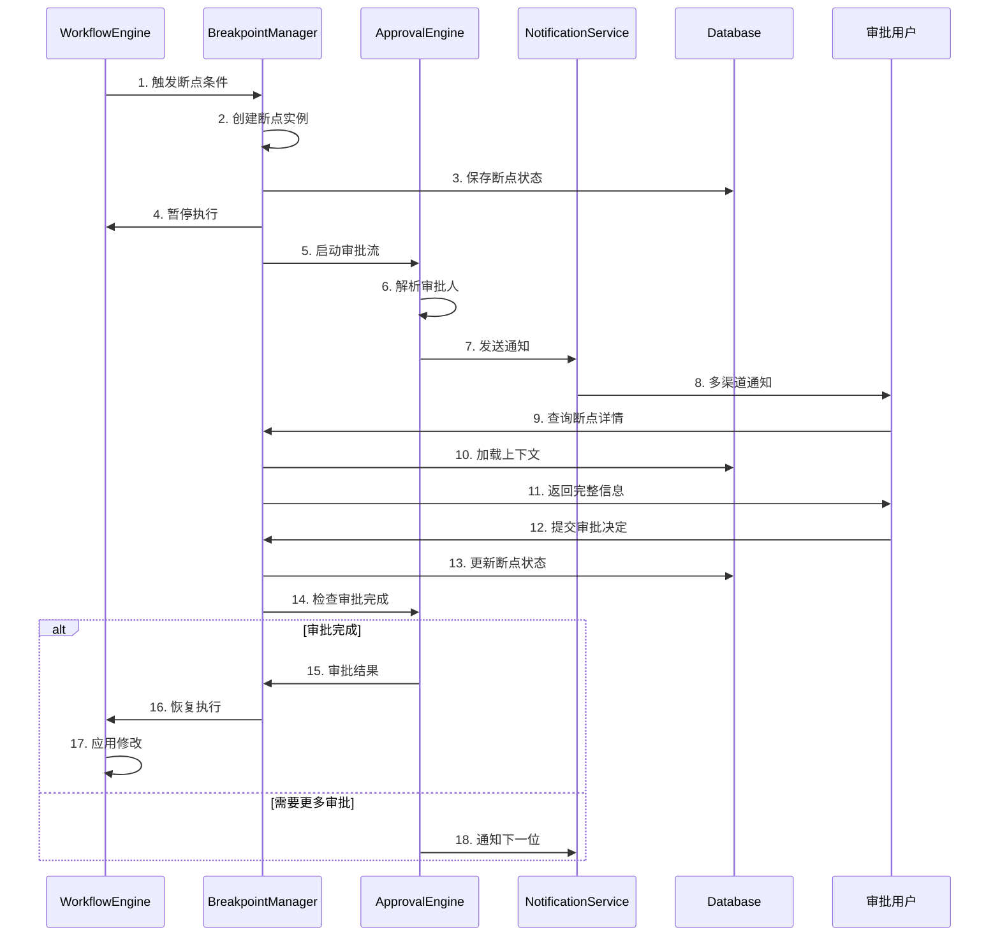

# 增强型 Agent 系统 - HITL 人机协同系统设计文档

**版本**: v1.0
**日期**: 2026-03-10
**状态**: 设计阶段

---

## 1. 概述

### 1.1 设计目标

HITL (Human-in-the-Loop) 系统是增强型 Agent 系统的核心差异化能力，旨在实现：

1. **可控性**: 关键节点人工审核，防止 AI 失控
2. **准确性**: 复杂决策人工确认，提升输出质量
3. **灵活性**: 实时干预执行流程，动态调整策略
4. **可追溯**: 完整记录人工干预历史，支持审计

### 1.2 核心能力

| 能力 | 说明 | 应用场景 |
|------|------|----------|
| **断点管理** | 动态/静态插入审核点 | 高风险操作、金额阈值 |
| **审批工作流** | 支持多种审批模式 | 多人协作、分级审批 |
| **实时干预** | 暂停、跳过、重试、回滚 | 异常处理、流程调整 |
| **任务回滚** | 单节点/多节点/全流程回滚 | 错误恢复、方案重置 |

---

## 2. 系统架构

### 2.1 架构图

```
┌─────────────────────────────────────────────────────────────────────────────┐
│                              HITL UI Layer                                   │
├─────────────────────────────────────────────────────────────────────────────┤
│  ┌─────────────────────┐  ┌─────────────────────┐  ┌─────────────────────┐  │
│  │    审批工作台        │  │    干预控制台        │  │    断点管理器        │  │
│  │  - 待办列表          │  │  - 实时状态监控      │  │  - 断点配置          │  │
│  │  - 审批详情          │  │  - 一键暂停/继续     │  │  - 条件规则          │  │
│  │  - 批量处理          │  │  - 参数修改          │  │  - 触发历史          │  │
│  └─────────────────────┘  └─────────────────────┘  └─────────────────────┘  │
└─────────────────────────────────────────────────────────────────────────────┘
                                      │
                                      ▼
┌─────────────────────────────────────────────────────────────────────────────┐
│                           HITL Core Service                                  │
├─────────────────────────────────────────────────────────────────────────────┤
│  ┌─────────────────────┐  ┌─────────────────────┐  ┌─────────────────────┐  │
│  │    Breakpoint       │  │    Approval         │  │    Intervention     │  │
│  │    Manager          │  │    Engine           │  │    Handler          │  │
│  │                     │  │                     │  │                     │  │
│  │ - 断点创建          │  │ - 审批流路由        │  │ - 暂停/恢复         │  │
│  │ - 状态管理          │  │ - 会签/或签         │  │ - 跳过/重试         │  │
│  │ - 超时处理          │  │ - 转交/委托         │  │ - 回滚执行          │  │
│  │ - 升级策略          │  │ - 批量审批          │  │ - 参数修改          │  │
│  └─────────────────────┘  └─────────────────────┘  └─────────────────────┘  │
│  ┌─────────────────────┐  ┌─────────────────────┐  ┌─────────────────────┐  │
│  │    Notification     │  │    Escalation       │  │    Audit Logger     │  │
│  │    Service          │  │    Service          │  │                     │  │
│  │                     │  │                     │  │ - 操作日志          │  │
│  │ - 多渠道通知        │  │ - 自动升级          │  │ - 变更历史          │  │
│  │ - 提醒策略          │  │ - 升级通知          │  │ - 审计追踪          │  │
│  │ - 消息模板          │  │ - 替代审批人        │  │ - 合规报告          │  │
│  └─────────────────────┘  └─────────────────────┘  └─────────────────────┘  │
└─────────────────────────────────────────────────────────────────────────────┘
                                      │
                                      ▼
┌─────────────────────────────────────────────────────────────────────────────┐
│                           Integration Layer                                  │
├─────────────────────────────────────────────────────────────────────────────┤
│  Workflow Engine ◄──── Event Bus ────► Notification Providers               │
│       │                                        (Email/SMS/DingTalk/WeChat)  │
│       │                                                                       │
│       └────────────────► User/Permission System                             │
└─────────────────────────────────────────────────────────────────────────────┘
```

### 2.2 核心组件职责

| 组件 | 职责 | 关键接口 |
|------|------|----------|
| BreakpointManager | 断点生命周期管理 | `create()`, `resolve()`, `cancel()` |
| ApprovalEngine | 审批流程编排 | `route()`, `process()`, `escalate()` |
| InterventionHandler | 实时干预执行 | `pause()`, `resume()`, `skip()`, `rollback()` |
| NotificationService | 多渠道通知 | `send()`, `remind()`, `batchNotify()` |
| EscalationService | 升级策略执行 | `escalate()`, `reassign()` |
| AuditLogger | 审计日志 | `log()`, `query()`, `export()` |

---

## 3. 断点系统详细设计

### 3.1 断点类型

```typescript
enum BreakpointType {
  /** 审批型：需要人工批准才能继续 */
  APPROVAL = 'approval',

  /** 审阅型：需人工查看确认，可修改 */
  REVIEW = 'review',

  /** 输入型：需要人工提供输入 */
  INPUT = 'input',

  /** 升级型：自动触发，需更高级别处理 */
  ESCALATION = 'escalation',

  /** 错误解决型：执行错误，需人工介入 */
  ERROR_RESOLUTION = 'error_resolution'
}

enum BreakpointTriggerMode {
  /** 静态断点：工作流定义时配置 */
  STATIC = 'static',

  /** 动态断点：运行时根据条件触发 */
  DYNAMIC = 'dynamic',

  /** 手动断点：运行时人工插入 */
  MANUAL = 'manual'
}
```

### 3.2 断点配置

```typescript
interface BreakpointConfig {
  // 基础配置
  enabled: boolean;
  type: BreakpointType;
  mode: BreakpointTriggerMode;

  // 触发条件（动态断点）
  condition?: {
    expression: string;           // 表达式，如 "${input.amount} > 10000"
    operator: 'eq' | 'gt' | 'lt' | 'gte' | 'lte' | 'in' | 'contains';
    field: string;
    value: any;
  };

  // 审批配置
  approvers?: {
    users?: string[];             // 指定用户
    roles?: string[];             // 指定角色
    departments?: string[];       // 指定部门
    dynamicResolver?: string;     // 动态解析器（如 "${context.owner}"）
  };

  // 审批模式
  approvalMode?: 'any' | 'all' | 'sequential' | 'vote';
  requiredApprovals?: number;     // 需要多少票

  // 超时配置
  timeout?: {
    duration: number;             // 分钟
    reminderIntervals: number[];  // 提醒间隔（分钟）
    autoAction?: 'escalate' | 'reject' | 'approve';
  };

  // 升级配置
  escalation?: {
    enabled: boolean;
    levels: EscalationLevel[];
  };

  // 上下文配置
  contextCapture?: {
    input: boolean;
    output: boolean;
    logs: boolean;
    executionPath: boolean;
  };

  // UI 配置
  uiConfig?: {
    title: string;
    description: string;
    fields: UIField[];            // 审批表单字段
    attachments: boolean;         // 是否允许附件
  };
}

interface EscalationLevel {
  level: number;
  condition: string;              // 升级条件
  approvers: string[];            // 升级后的审批人
  notifyChannels: string[];
  autoEscalateAfterMinutes: number;
}

interface UIField {
  name: string;
  label: string;
  type: 'text' | 'textarea' | 'number' | 'select' | 'checkbox' | 'date';
  required: boolean;
  editable: boolean;              // 审批人是否可编辑
  defaultValue?: any;
  options?: { label: string; value: any }[];
  validation?: {
    pattern?: string;
    min?: number;
    max?: number;
  };
}
```

### 3.3 断点状态机

```
                    ┌─────────────┐
                    │   PENDING   │
                    │   (待处理)   │
                    └──────┬──────┘
                           │
           ┌───────────────┼───────────────┐
           │               │               │
           ▼               ▼               ▼
    ┌─────────────┐ ┌─────────────┐ ┌─────────────┐
    │  IN_REVIEW  │ │  ESCALATED  │ │   EXPIRED   │
    │  (审批中)    │ │  (已升级)    │ │  (已过期)    │
    └──────┬──────┘ └──────┬──────┘ └──────┬──────┘
           │               │               │
           ▼               │               ▼
    ┌─────────────┐       │        ┌─────────────┐
    │   RESOLVED  │◄──────┘        │   TIMEOUT   │
    │   (已解决)   │                │  (超时关闭)  │
    └──────┬──────┘                └─────────────┘
           │
     ┌─────┴─────┬─────────┐
     ▼           ▼         ▼
┌─────────┐ ┌─────────┐ ┌─────────┐
│APPROVED │ │REJECTED │ │MODIFIED │
│ (已批准) │ │ (已拒绝) │ │ (已修改) │
└─────────┘ └─────────┘ └─────────┘
```

### 3.4 断点处理流程



---

## 4. 审批工作流设计

### 4.1 审批模式

| 模式 | 说明 | 适用场景 |
|------|------|----------|
| **或签 (Any)** | 任意一人审批通过即生效 | 普通审核 |
| **会签 (All)** | 所有人必须审批通过 | 重要决策 |
| **顺序签 (Sequential)** | 按顺序审批，一人通过后流向下一人 | 分级审批 |
| **投票 (Vote)** | 达到设定票数即通过 | 委员会决策 |

### 4.2 审批流定义

```typescript
interface ApprovalFlow {
  flowId: string;
  name: string;
  description?: string;

  // 触发条件
  trigger: {
    type: 'workflow_node' | 'condition' | 'manual';
    workflowIds?: string[];
    nodeIds?: string[];
    condition?: string;
  };

  // 审批步骤
  steps: ApprovalStep[];

  // 全局配置
  config: {
    timeout: number;
    allowTransfer: boolean;
    allowDelegate: boolean;
    allowBatch: boolean;
    requireComment: boolean;
  };
}

interface ApprovalStep {
  stepId: string;
  name: string;
  order: number;

  // 审批人配置
  approvers: {
    type: 'user' | 'role' | 'department' | 'dynamic';
    values: string[];
    dynamicExpression?: string;
  };

  // 审批模式
  mode: 'any' | 'all' | 'vote';
  requiredCount?: number;       // vote 模式需多少票

  // 条件分支
  condition?: string;           // 进入此步骤的条件

  // 超时配置
  timeout: {
    duration: number;
    autoAction: 'escalate' | 'reject' | 'approve' | 'remind';
    escalationStep?: string;    // 升级到哪一步
  };

  // 通知配置
  notifications: {
    channels: string[];
    template: string;
    reminderIntervals: number[];
  };
}
```

### 4.3 审批流程示例

**场景**: 商品定价审批（金额 > 10000）

```yaml
approvalFlow:
  name: "高价值商品定价审批"
  trigger:
    type: "condition"
    condition: "${input.price} > 10000"

  steps:
    - stepId: "step1"
      name: "品类经理初审"
      order: 1
      approvers:
        type: "dynamic"
        expression: "${context.categoryManager}"
      mode: "any"
      timeout:
        duration: 120  # 2小时
        autoAction: "escalate"
        escalationStep: "step2"

    - stepId: "step2"
      name: "部门总监复审"
      order: 2
      approvers:
        type: "dynamic"
        expression: "${context.departmentDirector}"
      mode: "any"
      condition: "${input.price} > 50000"
      timeout:
        duration: 240  # 4小时
        autoAction: "escalate"
        escalationStep: "step3"

    - stepId: "step3"
      name: "VP终审"
      order: 3
      approvers:
        type: "role"
        values: ["vp_sales"]
      mode: "any"
      timeout:
        duration: 480  # 8小时
        autoAction: "remind"
```

---

## 5. 实时干预系统

### 5.1 干预操作类型

```typescript
enum InterventionAction {
  /** 暂停执行 */
  PAUSE = 'pause',

  /** 恢复执行 */
  RESUME = 'resume',

  /** 跳过当前/指定节点 */
  SKIP = 'skip',

  /** 重试当前/指定节点 */
  RETRY = 'retry',

  /** 修改参数后重试 */
  RETRY_WITH_MODIFICATIONS = 'retry_with_modifications',

  /** 回滚到指定节点 */
  ROLLBACK = 'rollback',

  /** 强制完成 */
  FORCE_COMPLETE = 'force_complete',

  /** 强制失败 */
  FORCE_FAIL = 'force_fail',

  /** 插入断点 */
  INSERT_BREAKPOINT = 'insert_breakpoint'
}
```

### 5.2 干预处理器实现

```typescript
@Injectable()
export class InterventionHandler {
  constructor(
    private workflowEngine: WorkflowEngine,
    private executionRepository: ExecutionRepository,
    private eventEmitter: EventEmitter2,
    private auditLogger: AuditLogger
  ) {}

  async handleIntervention(
    executionId: string,
    action: InterventionAction,
    params: InterventionParams,
    operatorId: string
  ): Promise<InterventionResult> {
    // 1. 验证执行状态
    const execution = await this.executionRepository.findById(executionId);
    if (!execution) {
      throw new ExecutionNotFoundError(executionId);
    }

    // 2. 验证操作权限
    await this.validatePermission(execution, operatorId, action);

    // 3. 获取分布式锁
    const lock = await this.acquireLock(executionId);
    try {
      // 4. 执行干预
      const result = await this.executeIntervention(
        execution,
        action,
        params
      );

      // 5. 记录审计日志
      await this.auditLogger.log({
        type: 'intervention',
        executionId,
        action,
        params,
        operatorId,
        timestamp: new Date(),
        result
      });

      // 6. 发送事件
      this.eventEmitter.emit('execution.intervention', {
        executionId,
        action,
        operatorId,
        result
      });

      return result;
    } finally {
      await lock.release();
    }
  }

  private async executeIntervention(
    execution: WorkflowExecution,
    action: InterventionAction,
    params: InterventionParams
  ): Promise<InterventionResult> {
    switch (action) {
      case InterventionAction.PAUSE:
        return this.pauseExecution(execution);

      case InterventionAction.RESUME:
        return this.resumeExecution(execution);

      case InterventionAction.SKIP:
        return this.skipNode(execution, params.nodeId, params.fallbackValue);

      case InterventionAction.RETRY:
        return this.retryNode(execution, params.nodeId);

      case InterventionAction.RETRY_WITH_MODIFICATIONS:
        return this.retryWithModifications(
          execution,
          params.nodeId,
          params.modifications
        );

      case InterventionAction.ROLLBACK:
        return this.rollbackExecution(
          execution,
          params.targetNodeId,
          params.preserveContext
        );

      default:
        throw new UnsupportedInterventionError(action);
    }
  }

  private async rollbackExecution(
    execution: WorkflowExecution,
    targetNodeId: string,
    preserveContext: boolean
  ): Promise<InterventionResult> {
    // 1. 验证目标节点有效性
    const targetNode = execution.workflow.nodes.find(
      n => n.nodeId === targetNodeId
    );
    if (!targetNode) {
      throw new InvalidRollbackTargetError(targetNodeId);
    }

    // 2. 确定回滚范围
    const currentIndex = execution.executionPath.indexOf(
      execution.currentNodeId
    );
    const targetIndex = execution.executionPath.indexOf(targetNodeId);

    if (targetIndex === -1 || targetIndex > currentIndex) {
      throw new InvalidRollbackTargetError(targetNodeId);
    }

    const nodesToRollback = execution.executionPath.slice(
      targetIndex,
      currentIndex + 1
    );

    // 3. 执行补偿操作（反向执行）
    for (const nodeId of nodesToRollback.reverse()) {
      const nodeExecution = execution.nodeExecutions.find(
        ne => ne.nodeId === nodeId
      );

      if (nodeExecution?.output?.compensation) {
        await this.executeCompensation(nodeExecution);
      }

      // 标记为已回滚
      nodeExecution.status = 'rolled_back';
    }

    // 4. 恢复上下文到目标节点状态
    if (!preserveContext) {
      const targetContext = await this.getContextAtNode(
        execution,
        targetNodeId
      );
      execution.context = targetContext;
    }

    // 5. 更新执行状态
    execution.currentNodeId = targetNodeId;
    execution.status = 'running';

    await this.executionRepository.save(execution);

    // 6. 重新调度执行
    await this.workflowEngine.scheduleExecution(execution);

    return {
      success: true,
      executionId: execution.executionId,
      rolledBackNodes: nodesToRollback,
      resumedFrom: targetNodeId
    };
  }
}
```

### 5.3 回滚机制详解

```
执行路径: A → B → C → D (当前)
                 ↑
            回滚到 C

回滚过程:
1. 检查 C 和 D 是否有补偿操作
2. 执行 D.compensation()
3. 执行 C.compensation()
4. 恢复 context 到 C 的输出状态
5. 从 C 重新执行
```

**补偿操作定义**:

```typescript
interface CompensationConfig {
  // 是否需要补偿
  enabled: boolean;

  // 补偿类型
  type: 'automatic' | 'manual' | 'custom';

  // 自动补偿操作
  automaticAction?: {
    type: 'api_call' | 'message' | 'webhook';
    config: Record<string, any>;
  };

  // 自定义补偿脚本
  customScript?: string;

  // 补偿超时
  timeout: number;

  // 补偿失败处理
  onFailure: 'ignore' | 'retry' | 'alert' | 'block';
}
```

---

## 6. 通知系统设计

### 6.1 通知渠道

| 渠道 | 适用场景 | 优先级 |
|------|----------|--------|
| 站内信 | 所有场景 | 低 |
| 邮件 | 非紧急审批 | 中 |
| 短信 | 紧急审批、超时提醒 | 高 |
| 钉钉/企业微信 | 企业内部审批 | 中 |
| 电话 | 超紧急、多次未处理 | 紧急 |

### 6.2 通知策略

```typescript
interface NotificationStrategy {
  // 触发条件
  triggers: {
    onCreate: boolean;
    onEscalation: boolean;
    onTimeout: boolean;
    onReminder: boolean;
  };

  // 渠道优先级
  channelPriority: string[];

  // 提醒间隔（分钟）
  reminderIntervals: number[];

  // 升级通知
  escalationNotification: {
    enabled: boolean;
    notifyOriginalApprovers: boolean;
    notifyEscalatedApprovers: boolean;
    notifyManagers: boolean;
  };

  // 免打扰设置
  quietHours?: {
    start: string;    // "22:00"
    end: string;      // "08:00"
    timezone: string;
  };
}
```

### 6.3 通知模板

```typescript
interface NotificationTemplate {
  templateId: string;
  name: string;
  channels: string[];

  // 各渠道内容
  content: {
    [channel: string]: {
      title: string;
      body: string;
      actionUrl: string;
      actionText: string;
    };
  };

  // 变量替换
  variables: {
    name: string;
    description: string;
    source: 'context' | 'execution' | 'breakpoint' | 'user';
    path: string;
  }[];
}

// 示例模板
const approvalRequestTemplate: NotificationTemplate = {
  templateId: 'approval-request',
  name: '审批请求通知',
  channels: ['email', 'dingtalk', 'sms'],
  content: {
    email: {
      title: '【审批请求】{{workflowName}} - {{nodeName}}',
      body: `
        <p>您好，</p>
        <p>您有一个待处理的审批请求：</p>
        <ul>
          <li>工作流：{{workflowName}}</li>
          <li>节点：{{nodeName}}</li>
          <li>发起人：{{initiator}}</li>
          <li>截止时间：{{deadline}}</li>
        </ul>
        <p>点击查看详情并处理</p>
      `,
      actionUrl: '{{approvalUrl}}',
      actionText: '立即审批'
    },
    dingtalk: {
      title: '审批请求：{{workflowName}}',
      body: '您有一个待处理的审批请求，点击查看详情',
      actionUrl: '{{approvalUrl}}',
      actionText: '去审批'
    },
    sms: {
      title: '',
      body: '【Agent系统】您有{{workflowName}}的审批待处理，截止{{deadline}}，{{approvalUrl}}',
      actionUrl: '',
      actionText: ''
    }
  },
  variables: [
    { name: 'workflowName', description: '工作流名称', source: 'execution', path: 'workflowName' },
    { name: 'nodeName', description: '节点名称', source: 'breakpoint', path: 'nodeName' },
    { name: 'initiator', description: '发起人', source: 'execution', path: 'triggerInfo.triggeredBy' },
    { name: 'deadline', description: '截止时间', source: 'breakpoint', path: 'deadline' },
    { name: 'approvalUrl', description: '审批链接', source: 'context', path: 'approvalUrl' }
  ]
};
```

---

## 7. UI 设计规范

### 7.1 审批工作台

```
┌─────────────────────────────────────────────────────────────────────────────┐
│ 审批工作台                                      [搜索] [筛选 ▼] [批量 ▼]     │
├─────────────────────────────────────────────────────────────────────────────┤
│ ┌─────────────┐ ┌─────────────────────────────────────────────────────────┐ │
│ │  统计概览    │ │  待办列表                                                │ │
│ │             │ │  ┌─────────────────────────────────────────────────────┐ │ │
│ │ 待处理  12   │ │  │ 🔴 紧急  │ 商品定价审批  │ 截止时间: 2小时后      │ │ │
│ │ 今日已处理 5 │ │  │         │ 发起人: 张三   │ [查看] [批准] [拒绝]    │ │ │
│ │ 平均处理 15分│ │  └─────────────────────────────────────────────────────┘ │ │
│ │             │ │  ┌─────────────────────────────────────────────────────┐ │ │
│ │ [查看全部]  │ │  │ 🟡 普通  │ 内容发布审核  │ 截止时间: 明天         │ │ │
│ │             │ │  │         │ 发起人: 李四   │ [查看] [批准] [拒绝]    │ │ │
│ └─────────────┘ │  └─────────────────────────────────────────────────────┘ │ │
│                 │                                                        │ │
│ 快捷筛选        │  分页: [1] [2] [3] ... [10] >                            │ │
│ [全部] [审批]   │                                                        │ │
│ [审阅] [输入]   │                                                        │ │
└─────────────────┴────────────────────────────────────────────────────────┘
```

### 7.2 干预控制台

```
┌─────────────────────────────────────────────────────────────────────────────┐
│ 执行干预控制台                                      执行ID: WE-20240310-001 │
├─────────────────────────────────────────────────────────────────────────────┤
│ 工作流: 商品选品分析                                    状态: 🟡 运行中     │
│ 当前节点: 竞品分析 (Node-3)                            进度: 60%           │
├─────────────────────────────────────────────────────────────────────────────┤
│                                                                             │
│  执行流程图                                                                  │
│  ┌─────┐    ┌─────┐    ┌─────────┐    ┌─────┐    ┌─────┐                 │
│  │ ✓ A │───▶│ ✓ B │───▶│ 🟡 C    │───▶│ D   │───▶│ E   │                 │
│  └─────┘    └─────┘    └─────────┘    └─────┘    └─────┘                 │
│                          当前执行中                                        │
│                                                                             │
├─────────────────────────────────────────────────────────────────────────────┤
│ 快捷操作:                                                                   │
│ [暂停执行] [跳过当前] [重试] [修改参数] [回滚到...] [强制完成] [强制失败]   │
├─────────────────────────────────────────────────────────────────────────────┤
│ 实时日志:                                                                   │
│ 10:30:15 [INFO] 开始执行节点 C                                              │
│ 10:30:16 [INFO] 调用竞品分析Agent                                           │
│ 10:30:20 [INFO] 正在抓取数据...                                             │
│                                                                             │
└─────────────────────────────────────────────────────────────────────────────┘
```

---

## 8. 安全与审计

### 8.1 权限控制

```typescript
interface HITLPermission {
  // 资源类型
  resource: 'breakpoint' | 'execution' | 'approval_flow';

  // 操作类型
  actions: (
    | 'view'
    | 'create'
    | 'resolve'
    | 'intervene'
    | 'manage'
  )[];

  // 作用范围
  scope: {
    type: 'own' | 'department' | 'all';
    departmentIds?: string[];
    workflowIds?: string[];
  };

  // 数据权限
  dataAccess: {
    canViewLogs: boolean;
    canViewInput: boolean;
    canViewOutput: boolean;
    canModifyInput: boolean;
    canModifyOutput: boolean;
  };
}
```

### 8.2 审计日志

```typescript
interface HITLAuditLog {
  logId: string;
  timestamp: Date;

  // 操作信息
  action: string;
  actionType: 'breakpoint' | 'intervention' | 'approval' | 'config';

  // 操作对象
  target: {
    type: string;
    id: string;
    executionId?: string;
    workflowId?: string;
  };

  // 操作人
  operator: {
    userId: string;
    userName: string;
    role: string;
    ip: string;
    userAgent: string;
  };

  // 操作详情
  details: {
    before?: any;
    after?: any;
    changes?: Record<string, { from: any; to: any }>;
    reason?: string;
  };

  // 结果
  result: 'success' | 'failure';
  error?: string;
}
```

---

## 9. 性能设计

### 9.1 性能目标

| 指标 | 目标值 |
|------|--------|
| 断点创建延迟 | < 50ms |
| 审批提交响应 | < 100ms |
| 实时干预响应 | < 200ms |
| 并发断点处理 | 1000+ |
| 审批列表查询 | < 200ms (P99) |

### 9.2 优化策略

1. **缓存**: 审批人信息、权限配置缓存
2. **异步**: 通知发送、审计日志异步处理
3. **批量**: 支持批量审批操作
4. **分片**: 按执行ID分片存储断点数据

---

## 10. 附录

### 10.1 错误码

| 错误码 | 说明 |
|--------|------|
| HITL_001 | 断点不存在或已过期 |
| HITL_002 | 无审批权限 |
| HITL_003 | 断点已被处理 |
| HITL_004 | 审批已超时 |
| HITL_005 | 无效的干预操作 |
| HITL_006 | 回滚目标无效 |

### 10.2 变更记录

| 版本 | 日期 | 变更内容 |
|------|------|----------|
| v1.0 | 2026-03-10 | 初始版本 |
