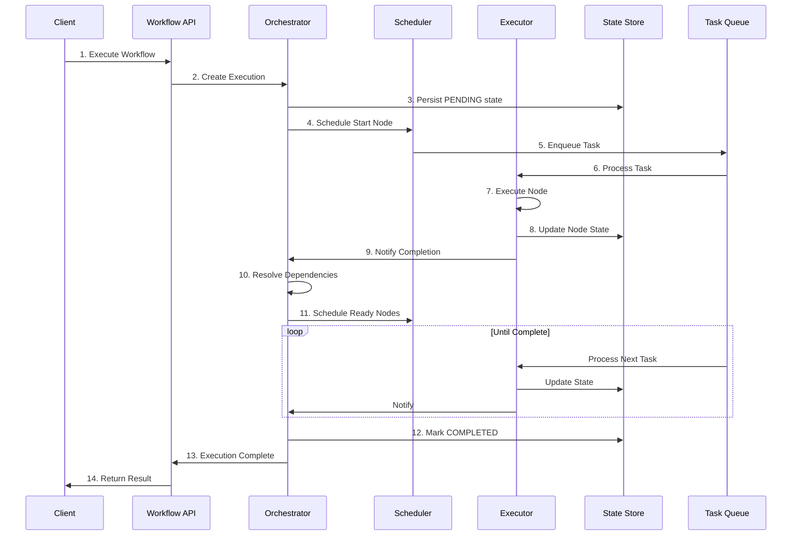

# 增强型 Agent 系统 - 工作流引擎设计文档

**版本**: v1.0
**日期**: 2026-03-10
**状态**: 设计阶段

---

## 1. 概述

### 1.1 设计目标

工作流引擎是执行层的核心组件，负责：

1. **流程编排**: 支持复杂的业务逻辑编排
2. **状态管理**: 可靠的状态持久化和恢复
3. **高可用**: 故障自动转移，断点续传
4. **可观测**: 全链路监控和追踪
5. **可扩展**: 支持自定义节点类型

### 1.2 核心能力

| 能力 | 说明 | 技术实现 |
|------|------|----------|
| DAG 执行 | 有向无环图执行 | 拓扑排序 + 依赖解析 |
| 状态机 | 节点状态管理 | 事件溯源模式 |
| 重试机制 | 失败自动重试 | 指数退避 |
| 并行执行 | 无依赖节点并行 | 协程池 |
| 子流程 | 支持嵌套工作流 | 递归执行 |
| 动态调度 | 运行时调整 | 条件分支 + 循环 |

---

## 2. 系统架构

### 2.1 架构图

```
┌─────────────────────────────────────────────────────────────────────────────┐
│                           Workflow Engine API                                │
├─────────────────────────────────────────────────────────────────────────────┤
│  REST API │ GraphQL │ WebSocket │ gRPC                                       │
└─────────────────────────────────────────────────────────────────────────────┘
                                      │
                                      ▼
┌─────────────────────────────────────────────────────────────────────────────┐
│                           Workflow Runtime                                   │
├─────────────────────────────────────────────────────────────────────────────┤
│  ┌─────────────────────┐  ┌─────────────────────┐  ┌─────────────────────┐  │
│  │    Orchestrator     │  │    Scheduler        │  │    State Manager    │  │
│  │                     │  │                     │  │                     │  │
│  │ - 流程协调          │  │ - 任务调度          │  │ - 状态持久化        │  │
│  │ - 依赖解析          │  │ - 优先级管理        │  │ - 快照管理          │  │
│  │ - 并行控制          │  │ - 资源分配          │  │ - 版本控制          │  │
│  └─────────────────────┘  └─────────────────────┘  └─────────────────────┘  │
│  ┌─────────────────────┐  ┌─────────────────────┐  ┌─────────────────────┐  │
│  │    Executor         │  │    Event Handler    │  │    Error Handler    │  │
│  │                     │  │                     │  │                     │  │
│  │ - 节点执行          │  │ - 事件路由          │  │ - 错误分类          │  │
│  │ - Agent 调用        │  │ - 状态变更          │  │ - 重试策略          │  │
│  │ - 结果处理          │  │ - 外部通知          │  │ - 补偿执行          │  │
│  └─────────────────────┘  └─────────────────────┘  └─────────────────────┘  │
└─────────────────────────────────────────────────────────────────────────────┘
                                      │
                                      ▼
┌─────────────────────────────────────────────────────────────────────────────┐
│                           Node Type Registry                                 │
├─────────────────────────────────────────────────────────────────────────────┤
│  LLM Node │ API Node │ Condition Node │ Loop Node │ Subflow Node │ Custom   │
└─────────────────────────────────────────────────────────────────────────────┘
                                      │
                                      ▼
┌─────────────────────────────────────────────────────────────────────────────┤
│                           Storage Layer                                      │
├─────────────────────────────────────────────────────────────────────────────┤
│  MongoDB (State) │ Redis (Cache) │ Event Store (Event Sourcing)              │
└─────────────────────────────────────────────────────────────────────────────┘
```

### 2.2 核心组件职责

| 组件 | 职责 | 关键技术 |
|------|------|----------|
| Orchestrator | 工作流执行协调 | DAG 遍历算法 |
| Scheduler | 任务调度分发 | 优先级队列 |
| State Manager | 状态持久化管理 | 事件溯源 |
| Executor | 节点执行器 | 插件架构 |
| Event Handler | 事件处理 | 发布订阅 |
| Error Handler | 错误处理 | 重试模式 |

---

## 3. 工作流定义模型

### 3.1 DAG 模型

```typescript
interface WorkflowDAG {
  // 节点集合
  nodes: WorkflowNode[];

  // 边集合（依赖关系）
  edges: WorkflowEdge[];

  // 起始节点
  startNodes: string[];

  // 结束节点
  endNodes: string[];
}

interface WorkflowNode {
  nodeId: string;
  name: string;
  type: NodeType;

  // 执行配置
  config: NodeConfig;

  // 输入输出定义
  inputSchema: JSONSchema;
  outputSchema: JSONSchema;

  // 依赖（入边）
  dependencies: string[];

  // 被依赖（出边）
  dependents: string[];
}

interface WorkflowEdge {
  from: string;           // 源节点ID
  to: string;             // 目标节点ID
  condition?: string;     // 条件表达式
  type: 'normal' | 'error' | 'fallback';
}

enum NodeType {
  // 基础类型
  START = 'start',
  END = 'end',

  // 执行类型
  LLM = 'llm',
  API = 'api',
  CODE = 'code',

  // 控制流
  CONDITION = 'condition',
  LOOP = 'loop',
  PARALLEL = 'parallel',
  SUBFLOW = 'subflow',

  // 人工介入
  HITL = 'hitl',

  // 事件
  EVENT = 'event',
  TIMER = 'timer',

  // 自定义
  CUSTOM = 'custom'
}
```

### 3.2 节点配置详情

```typescript
// LLM 节点
interface LLMNodeConfig {
  agentId: string;
  promptTemplate?: string;
  modelConfig: {
    model: string;
    temperature: number;
    maxTokens: number;
    topP?: number;
  };
  tools?: string[];
  outputFormat?: 'text' | 'json' | 'markdown';
}

// API 节点
interface APINodeConfig {
  method: 'GET' | 'POST' | 'PUT' | 'DELETE' | 'PATCH';
  url: string;
  headers?: Record<string, string>;
  body?: any;
  timeout: number;
  retryPolicy: RetryPolicy;
  errorHandling: ErrorHandlingConfig;
}

// 条件节点
interface ConditionNodeConfig {
  branches: {
    id: string;
    condition: string;      // 条件表达式
    targetNodeId: string;
  }[];
  defaultBranch?: string;   // 默认分支
}

// 循环节点
interface LoopNodeConfig {
  loopType: 'for' | 'while' | 'foreach';
  iterator?: string;        // foreach 迭代变量
  collection?: string;      // foreach 集合表达式
  condition?: string;       // while 条件
  maxIterations: number;    // 最大循环次数
  loopBody: string[];       // 循环体内的节点
}

// 并行节点
interface ParallelNodeConfig {
  branches: {
    id: string;
    nodes: string[];        // 分支内的节点
  }[];
  aggregationStrategy: 'all' | 'any' | 'race' | 'custom';
  customAggregator?: string; // 自定义聚合逻辑
}

// 子流程节点
interface SubflowNodeConfig {
  workflowId: string;
  inputMapping: Record<string, string>;
  outputMapping: Record<string, string>;
  waitForCompletion: boolean;
  timeout: number;
}

// HITL 节点
interface HITLNodeConfig {
  type: 'approval' | 'review' | 'input';
  approvers: string[];
  timeout: number;
  reminderIntervals: number[];
  escalationRule?: EscalationRule;
}
```

---

## 4. 执行引擎设计

### 4.1 执行流程



### 4.2 状态机

```
┌─────────┐     ┌─────────┐     ┌─────────┐
│ PENDING │────▶│SCHEDULED│────▶│ RUNNING │
└─────────┘     └─────────┘     └────┬────┘
                                     │
         ┌───────────────────────────┼───────────┐
         │                           │           │
         ▼                           ▼           ▼
    ┌─────────┐               ┌─────────┐ ┌─────────┐
    │ COMPLETED│               │  FAILED │ │CANCELLED│
    └─────────┘               └────┬────┘ └─────────┘
                                   │
                    ┌──────────────┼──────────────┐
                    │              │              │
                    ▼              ▼              ▼
              ┌─────────┐   ┌─────────┐   ┌─────────┐
              │ RETRYING│   │ROLLBACK │   │COMPENSAT│
              └─────────┘   └─────────┘   └─────────┘
```

### 4.3 核心类实现

```typescript
@Injectable()
export class WorkflowOrchestrator {
  constructor(
    private stateManager: StateManager,
    private scheduler: TaskScheduler,
    private executor: NodeExecutor,
    private eventEmitter: EventEmitter2,
    private dagResolver: DAGResolver
  ) {}

  async startExecution(
    workflowId: string,
    input: Record<string, any>,
    options: ExecutionOptions
  ): Promise<WorkflowExecution> {
    // 1. 加载工作流定义
    const workflow = await this.loadWorkflow(workflowId);

    // 2. 创建执行实例
    const execution = await this.createExecution(workflow, input, options);

    // 3. 解析 DAG
    const dag = this.dagResolver.resolve(workflow.nodes);

    // 4. 找到起始节点
    const startNodes = dag.getStartNodes();

    // 5. 调度起始节点
    for (const node of startNodes) {
      await this.scheduleNode(execution, node);
    }

    return execution;
  }

  async onNodeCompleted(
    executionId: string,
    nodeId: string,
    result: NodeExecutionResult
  ): Promise<void> {
    // 1. 更新节点状态
    await this.stateManager.updateNodeState(executionId, nodeId, {
      status: result.success ? 'completed' : 'failed',
      output: result.output,
      error: result.error
    });

    // 2. 如果失败，处理错误
    if (!result.success) {
      await this.handleNodeFailure(executionId, nodeId, result.error);
      return;
    }

    // 3. 找到下游节点
    const execution = await this.stateManager.getExecution(executionId);
    const downstreamNodes = this.dagResolver.getDownstreamNodes(
      execution.workflow,
      nodeId
    );

    // 4. 检查依赖是否全部满足
    for (const nextNode of downstreamNodes) {
      const dependencies = this.dagResolver.getDependencies(
        execution.workflow,
        nextNode.nodeId
      );

      const allDependenciesCompleted = await this.checkDependenciesCompleted(
        executionId,
        dependencies
      );

      if (allDependenciesCompleted) {
        // 5. 检查条件分支
        const shouldExecute = await this.evaluateConditions(
          execution,
          nextNode
        );

        if (shouldExecute) {
          await this.scheduleNode(execution, nextNode);
        } else {
          // 标记为跳过
          await this.stateManager.updateNodeState(executionId, nextNode.nodeId, {
            status: 'skipped'
          });
        }
      }
    }

    // 6. 检查是否全部完成
    await this.checkExecutionComplete(executionId);
  }

  private async handleNodeFailure(
    executionId: string,
    nodeId: string,
    error: Error
  ): Promise<void> {
    const execution = await this.stateManager.getExecution(executionId);
    const node = execution.workflow.nodes.find(n => n.nodeId === nodeId);

    // 1. 检查重试策略
    if (node.config.retryPolicy && node.config.retryPolicy.maxRetries > 0) {
      const nodeState = execution.nodeExecutions.find(
        ne => ne.nodeId === nodeId
      );

      if (nodeState.retryCount < node.config.retryPolicy.maxRetries) {
        // 重试
        await this.scheduleNode(execution, node, { isRetry: true });
        return;
      }
    }

    // 2. 检查错误处理策略
    switch (node.config.errorHandling?.strategy) {
      case 'continue':
        // 忽略错误继续
        await this.onNodeCompleted(executionId, nodeId, {
          success: true,
          output: node.config.errorHandling.fallbackValue
        });
        break;

      case 'skip':
        // 跳过节点
        await this.stateManager.updateNodeState(executionId, nodeId, {
          status: 'skipped'
        });
        await this.onNodeCompleted(executionId, nodeId, {
          success: true,
          output: null
        });
        break;

      case 'rollback':
        // 回滚到指定节点
        await this.rollbackExecution(
          executionId,
          node.config.errorHandling.rollbackTarget
        );
        break;

      case 'fail':
      default:
        // 标记执行失败
        await this.failExecution(executionId, error);
    }
  }

  private async evaluateConditions(
    execution: WorkflowExecution,
    node: WorkflowNode
  ): Promise<boolean> {
    if (node.type !== NodeType.CONDITION) {
      return true;
    }

    const config = node.config as ConditionNodeConfig;
    const context = execution.context;

    for (const branch of config.branches) {
      const result = await this.evaluateExpression(branch.condition, context);
      if (result) {
        return true;
      }
    }

    return false;
  }

  private async scheduleNode(
    execution: WorkflowExecution,
    node: WorkflowNode,
    options?: ScheduleOptions
  ): Promise<void> {
    // 更新节点状态为 SCHEDULED
    await this.stateManager.updateNodeState(execution.executionId, node.nodeId, {
      status: 'scheduled',
      scheduledAt: new Date()
    });

    // 创建任务
    const task: Task = {
      id: generateTaskId(),
      type: 'node_execution',
      executionId: execution.executionId,
      nodeId: node.nodeId,
      priority: execution.priority,
      scheduledAt: new Date()
    };

    // 提交到调度器
    await this.scheduler.schedule(task);
  }
}
```

---

## 5. 任务调度器

### 5.1 调度策略

```typescript
interface TaskScheduler {
  // 调度任务
  schedule(task: Task): Promise<void>;

  // 取消任务
  cancel(taskId: string): Promise<void>;

  // 重新调度
  reschedule(taskId: string, newTime: Date): Promise<void>;
}

// 优先级队列实现
@Injectable()
export class PriorityTaskScheduler implements TaskScheduler {
  constructor(
    @InjectQueue('workflow-tasks') private taskQueue: Queue,
    private config: SchedulerConfig
  ) {}

  async schedule(task: Task): Promise<void> {
    const jobOptions: JobsOptions = {
      priority: this.calculatePriority(task),
      attempts: task.maxRetries || 3,
      backoff: {
        type: 'exponential',
        delay: 1000
      },
      removeOnComplete: 100,
      removeOnFail: 50
    };

    await this.taskQueue.add('execute-node', task, jobOptions);
  }

  private calculatePriority(task: Task): number {
    // 优先级计算：基础优先级 + 紧急度加成
    const basePriority = task.priority === 'urgent' ? 10 :
                        task.priority === 'high' ? 20 :
                        task.priority === 'normal' ? 30 : 40;

    // 等待时间越长，优先级越高（防饿死）
    const waitTime = Date.now() - task.createdAt.getTime();
    const starvationBonus = Math.min(Math.floor(waitTime / 60000), 10);

    return Math.max(1, basePriority - starvationBonus);
  }
}
```

### 5.2 并发控制

```typescript
@Injectable()
export class ConcurrencyController {
  private semaphore: Semaphore;

  constructor(config: ConcurrencyConfig) {
    this.semaphore = new Semaphore(config.maxConcurrentExecutions);
  }

  async acquire(executionId: string): Promise<void> {
    await this.semaphore.acquire();
    // 记录占用
    await this.recordAcquisition(executionId);
  }

  release(executionId: string): void {
    this.semaphore.release();
    // 记录释放
    this.recordRelease(executionId);
  }

  // 按用户限流
  async acquirePerUser(userId: string): Promise<boolean> {
    const current = await this.getUserConcurrentCount(userId);
    const limit = await this.getUserConcurrencyLimit(userId);

    if (current >= limit) {
      return false;
    }

    await this.incrementUserCount(userId);
    return true;
  }
}
```

---

## 6. 状态管理

### 6.1 事件溯源

```typescript
// 工作流事件
interface WorkflowEvent {
  eventId: string;
  eventType: WorkflowEventType;
  executionId: string;
  timestamp: Date;
  payload: Record<string, any>;
  version: number;              // 事件版本
}

enum WorkflowEventType {
  EXECUTION_STARTED = 'execution.started',
  EXECUTION_COMPLETED = 'execution.completed',
  EXECUTION_FAILED = 'execution.failed',
  EXECUTION_CANCELLED = 'execution.cancelled',

  NODE_SCHEDULED = 'node.scheduled',
  NODE_STARTED = 'node.started',
  NODE_COMPLETED = 'node.completed',
  NODE_FAILED = 'node.failed',
  NODE_SKIPPED = 'node.skipped',
  NODE_ROLLED_BACK = 'node.rolled_back',

  CONTEXT_UPDATED = 'context.updated',
  VARIABLE_SET = 'variable.set',

  HITL_BREAKPOINT_CREATED = 'hitl.breakpoint.created',
  HITL_BREAKPOINT_RESOLVED = 'hitl.breakpoint.resolved'
}

@Injectable()
export class EventSourcedStateManager {
  constructor(
    private eventStore: EventStore,
    private snapshotStore: SnapshotStore
  ) {}

  async getExecution(executionId: string): Promise<WorkflowExecution> {
    // 1. 加载最新快照
    const snapshot = await this.snapshotStore.getLatest(executionId);

    // 2. 从快照版本加载后续事件
    const fromVersion = snapshot?.version || 0;
    const events = await this.eventStore.getEvents(
      executionId,
      fromVersion
    );

    // 3. 重放事件
    let execution = snapshot?.state || this.createEmptyExecution(executionId);
    for (const event of events) {
      execution = this.applyEvent(execution, event);
    }

    return execution;
  }

  async applyEvent(
    execution: WorkflowExecution,
    event: WorkflowEvent
  ): Promise<WorkflowExecution> {
    switch (event.eventType) {
      case WorkflowEventType.NODE_STARTED:
        return this.applyNodeStarted(execution, event);
      case WorkflowEventType.NODE_COMPLETED:
        return this.applyNodeCompleted(execution, event);
      case WorkflowEventType.CONTEXT_UPDATED:
        return this.applyContextUpdated(execution, event);
      // ... 其他事件类型
      default:
        return execution;
    }
  }

  async saveEvent(event: WorkflowEvent): Promise<void> {
    await this.eventStore.append(event);

    // 定期创建快照
    if (event.version % 10 === 0) {
      await this.createSnapshot(event.executionId);
    }
  }

  private async createSnapshot(executionId: string): Promise<void> {
    const execution = await this.getExecution(executionId);
    await this.snapshotStore.save({
      executionId,
      version: execution.version,
      state: execution,
      createdAt: new Date()
    });
  }
}
```

### 6.2 快照策略

```typescript
interface SnapshotStrategy {
  // 每 N 个事件创建快照
  frequency: number;

  // 最大快照数量
  maxSnapshots: number;

  // 快照压缩
  compression: boolean;

  // 清理策略
  cleanupPolicy: 'keep-latest' | 'time-based';

  // 时间范围（time-based）
  retentionDays?: number;
}
```

---

## 7. 节点执行器

### 7.1 节点执行器接口

```typescript
interface NodeExecutor {
  // 节点类型
  type: NodeType;

  // 执行节点
  execute(
    node: WorkflowNode,
    context: ExecutionContext
  ): Promise<NodeExecutionResult>;

  // 验证配置
  validate(config: NodeConfig): ValidationResult;

  // 补偿执行（用于回滚）
  compensate?(
    node: WorkflowNode,
    context: ExecutionContext
  ): Promise<void>;
}

// 执行上下文
interface ExecutionContext {
  executionId: string;
  workflow: WorkflowDefinition;
  variables: Record<string, any>;
  secrets: Record<string, string>;
  services: ServiceRegistry;
  logger: Logger;
}

// 执行结果
interface NodeExecutionResult {
  success: boolean;
  output?: any;
  error?: Error;
  metrics?: {
    startTime: Date;
    endTime: Date;
    duration: number;
    tokenUsage?: number;
  };
}
```

### 7.2 LLM 节点执行器

```typescript
@Injectable()
export class LLMNodeExecutor implements NodeExecutor {
  type = NodeType.LLM;

  constructor(
    private agentService: AgentService,
    private promptAssembler: PromptAssemblerService,
    private memoryService: MemoryService
  ) {}

  async execute(
    node: WorkflowNode,
    context: ExecutionContext
  ): Promise<NodeExecutionResult> {
    const config = node.config as LLMNodeConfig;
    const startTime = Date.now();

    try {
      // 1. 组装提示词
      const prompt = await this.promptAssembler.assemble({
        template: config.promptTemplate,
        variables: context.variables,
        context: {
          userId: context.variables.userId,
          sessionId: context.executionId
        }
      });

      // 2. 调用 Agent
      const response = await this.agentService.invoke({
        agentId: config.agentId,
        input: {
          prompt: prompt.fullPrompt,
          tools: config.tools,
          format: config.outputFormat
        },
        modelConfig: config.modelConfig
      });

      // 3. 解析输出
      const output = this.parseOutput(response.output, config.outputFormat);

      // 4. 更新记忆
      await this.memoryService.saveInteraction({
        userId: context.variables.userId,
        sessionId: context.executionId,
        input: prompt.fullPrompt,
        output: output,
        metadata: {
          nodeId: node.nodeId,
          agentId: config.agentId
        }
      });

      return {
        success: true,
        output,
        metrics: {
          startTime: new Date(startTime),
          endTime: new Date(),
          duration: Date.now() - startTime,
          tokenUsage: response.tokenUsage?.total
        }
      };
    } catch (error) {
      return {
        success: false,
        error: error as Error,
        metrics: {
          startTime: new Date(startTime),
          endTime: new Date(),
          duration: Date.now() - startTime
        }
      };
    }
  }

  private parseOutput(output: any, format: string): any {
    switch (format) {
      case 'json':
        return typeof output === 'string' ? JSON.parse(output) : output;
      case 'markdown':
        return { content: output, format: 'markdown' };
      default:
        return output;
    }
  }
}
```

### 7.3 注册中心

```typescript
@Injectable()
export class NodeExecutorRegistry {
  private executors = new Map<NodeType, NodeExecutor>();

  register(executor: NodeExecutor): void {
    this.executors.set(executor.type, executor);
  }

  get(type: NodeType): NodeExecutor {
    const executor = this.executors.get(type);
    if (!executor) {
      throw new UnknownNodeTypeError(type);
    }
    return executor;
  }

  // 插件化加载
  async loadCustomExecutor(modulePath: string): Promise<void> {
    const module = await import(modulePath);
    const executor = new module.default();
    this.register(executor);
  }
}
```

---

## 8. 可观测性

### 8.1 追踪

```typescript
@Injectable()
export class WorkflowTracer {
  constructor(private tracer: Tracer) {}

  async traceExecution<T>(
    executionId: string,
    operation: string,
    fn: () => Promise<T>
  ): Promise<T> {
    const span = this.tracer.startSpan(`workflow.${operation}`, {
      attributes: {
        'workflow.execution_id': executionId,
        'workflow.operation': operation
      }
    });

    try {
      const result = await fn();
      span.setStatus({ code: SpanStatusCode.OK });
      return result;
    } catch (error) {
      span.recordException(error as Error);
      span.setStatus({
        code: SpanStatusCode.ERROR,
        message: (error as Error).message
      });
      throw error;
    } finally {
      span.end();
    }
  }
}
```

### 8.2 指标

```typescript
// 关键指标
const WORKFLOW_METRICS = {
  // 执行计数
  EXECUTION_TOTAL: 'workflow_execution_total',
  EXECUTION_SUCCESS: 'workflow_execution_success',
  EXECUTION_FAILURE: 'workflow_execution_failure',

  // 执行时长
  EXECUTION_DURATION: 'workflow_execution_duration_seconds',
  NODE_DURATION: 'workflow_node_duration_seconds',

  // 队列指标
  QUEUE_SIZE: 'workflow_queue_size',
  QUEUE_WAIT_TIME: 'workflow_queue_wait_seconds',

  // 状态分布
  EXECUTION_STATUS: 'workflow_execution_status',

  // 资源使用
  ACTIVE_EXECUTIONS: 'workflow_active_executions',
  CONCURRENT_NODES: 'workflow_concurrent_nodes'
};
```

---

## 9. 性能优化

### 9.1 优化策略

| 策略 | 实现 | 效果 |
|------|------|------|
| 预编译 | DAG 预解析缓存 | 减少重复计算 |
| 批处理 | 事件批量写入 | 降低 I/O |
| 缓存 | 工作流定义缓存 | 减少 DB 查询 |
| 异步化 | 非关键路径异步 | 降低延迟 |
| 连接池 | DB/Redis 连接池 | 提高吞吐 |

### 9.2 性能目标

| 指标 | 目标 |
|------|------|
| 工作流启动延迟 | < 50ms |
| 节点调度延迟 | < 10ms |
| 简单工作流完成时间 | < 1s |
| 复杂工作流（100节点） | < 30s |
| 并发执行数 | 1000+ |

---

## 10. 附录

### 10.1 错误码

| 错误码 | 说明 |
|--------|------|
| WF_001 | 工作流定义不存在 |
| WF_002 | 工作流定义无效 |
| WF_003 | 执行实例不存在 |
| WF_004 | 节点类型不支持 |
| WF_005 | 循环依赖检测 |
| WF_006 | 执行超时 |

### 10.2 变更记录

| 版本 | 日期 | 变更内容 |
|------|------|----------|
| v1.0 | 2026-03-10 | 初始版本 |
